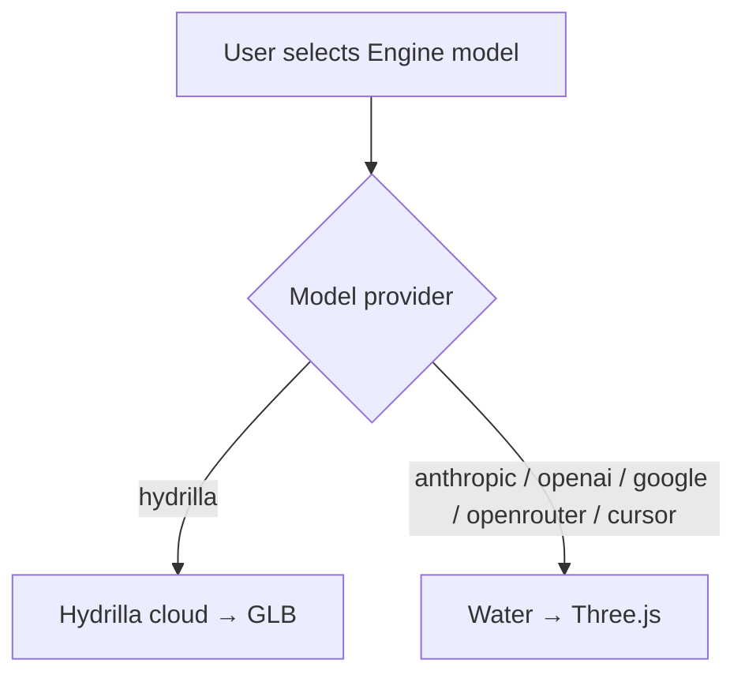
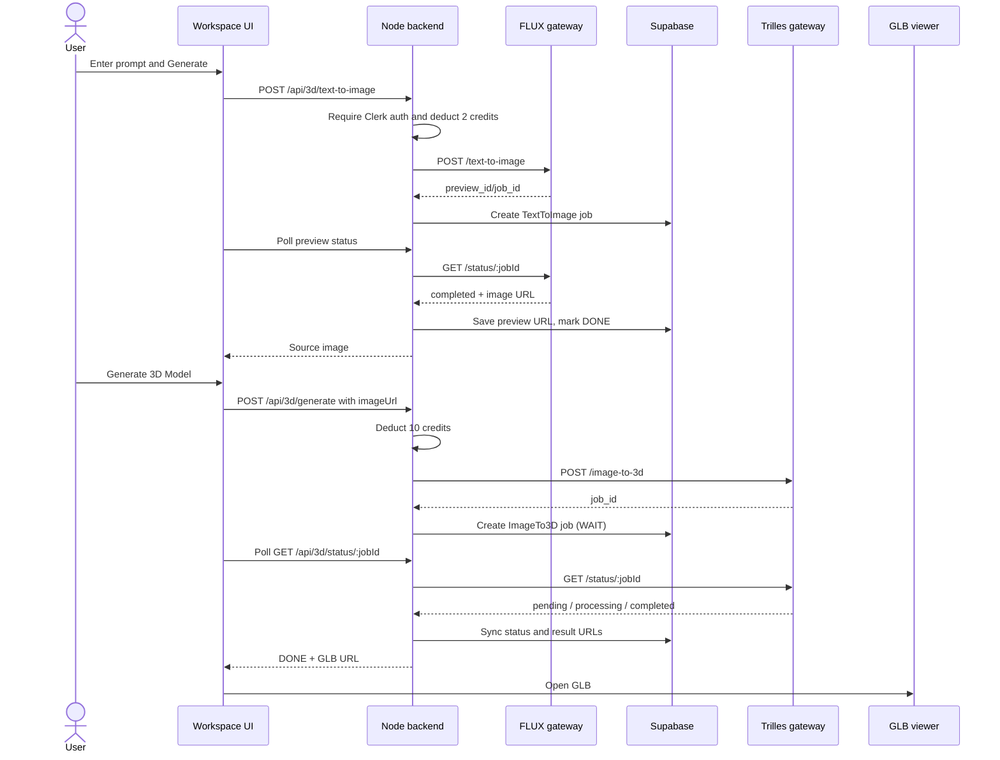
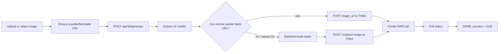

# Hydrilla cloud generation flows (Trilles / GPU)

> **Engines overview (Cloud vs Water, BYOK, auth, artifacts):**  
> see [`ENGINES.md`](./ENGINES.md) — that file is the source of truth for Water and naming.

This document keeps **deep detail for the Hydrilla cloud (Trilles) GPU path only**.  
Water is summarized here; do not duplicate Water implementation notes here.

---

## 1. Routing (both engines)



- Cloud: `selectedIsCode === false` → `/api/3d/*`, credits, GPU.
- Water: `selectedIsCode === true` → `/api/water/*`, 0 credits, no GPU.
- Water models (catalog + live sync + prefs): [`ENGINES.md`](./ENGINES.md), [`WATER_PROVIDERS.md`](./WATER_PROVIDERS.md).
- Water pipeline / gates: [`WATER_ORCHESTRATION.md`](./WATER_ORCHESTRATION.md).

**Auth:** Clerk JWT (`requireAuth` on generate). No invite / approved-email gate.

---

## 2. Hydrilla cloud (Trilles) flow

### Contract

- **Primary input:** an image.
- **Optional first stage:** text, edit, or combine can create the source image.
- **Compute:** Hydrilla's FLUX and Trilles GPU gateways (same host by default: `https://api.hydrilla.co`).
- **Output:** GLB plus a preview image.
- **Persistence:** Supabase `jobs`, workspace relations, and lineage.
- **Billing:** Hydrilla credits.

Current credit charges in
`backend/hydrilla_backend/src/routes/threeD.ts`:

- text-to-image: **2 credits**
- one-image edit: **3 credits**
- two-image combine: **4 credits**
- image-to-3D or direct text-to-3D backend route: **10 credits**

The workspace does not use the backend's direct text-to-3D branch. Its live
text-to-mesh UX is text-to-image (2) followed by image-to-3D (10), for a total
of **12 credits**.

Credits are deducted atomically when the operation is submitted
(`backend/hydrilla_backend/src/services/credits.ts`). Free tier starts at **200** credits; Creator **1000** / Studio **4000** via Dodo subscriptions.

### GPU health / feature gates

Frontend `lib/apiHealth.ts` probes `GET {BACKEND}/api/3d/health`, else `GET {GPU}/health`.

| Mode | Edit / Combine |
|------|----------------|
| `low` | Disabled (`edit_image` / `combined_edit` false) |
| `high` | Enabled (Flux features available) |

**Single GPU host** — `NEXT_PUBLIC_API_URL` or default `https://api.hydrilla.co`. No primary/alternative failover in the frontend.

Backend env (optional overrides, all default to the same host):

- `HUNYUAN_API_URL`
- `FLUX_GATEWAY_URL` / `FLUX_API_URL`
- `TRELLIS_GATEWAY_URL` / `TRELLIS_API_URL`

### 2.1 Text to image to Trilles



Key frontend functions:

- `handleGenerateImage()` / `handleGenerate3D()` / `start3DFromImage()` — `app/workspace/page.tsx`
- `generatePreviewImage()` / `submitImageTo3D()` — `lib/api.ts`

### 2.2 Uploaded image to Trilles



`submitImageTo3D()` posts via the Node backend. The backend
rejects `blob:` and `data:` URLs. For owned S3 / localhost / unreachable URLs,
it loads bytes and posts multipart to Trilles.

### 2.3 Edit and combine

Preprocessing for the mesh engine only (disabled for Water models; also gated by GPU `mode=high`):

- **Edit:** `POST /api/3d/edit-image`, 3 credits.
- **Combine:** `POST /api/3d/combined-edit`, 4 credits.
- Then `start3DFromImage()` for +10 credits.

UI caveat: the cost line may understate Edit/Combine; backend still charges 3/4.

### 2.4 Trilles state and polling

```text
pending     -> WAIT
processing  -> RUN
completed   -> DONE
failed      -> FAIL
cancelled   -> FAIL
```

Workspace polls `GET /api/3d/status/:jobId` every ~3s (long UI cap).  
Library refresh polls workspace jobs every ~5s while jobs are active.

Backend status sync paths:

1. **Client poll** (primary on Vercel) — status endpoint fetches GPU when job is not terminal.
2. **Background `syncAllJobs()`** — only on long-running `src/server.ts` (`POLL_INTERVAL_MS`, default **2000**). Skips Water jobs. Circuit-breaks on repeated failures.
3. **GPU webhook** — `POST /api/3d/webhook/job-update` (optional).

Vercel serverless (`api/index.ts`) has **no** background sync loop.

### 2.5 Trilles failure behavior

- Insufficient credits → HTTP `402`.
- Network/gateway submit failure → surfaced as GPU unavailable.
- Status falls back to DB when gateway is temporarily down.
- Feature unavailable (edit/combine on low mode) → `FEATURE_UNAVAILABLE`.
- Credits are deducted before gateway submit completes (no automatic refund today).

---

## 3. Water (summary only)

Full documentation: **[`ENGINES.md`](./ENGINES.md)** + **[`WATER_ORCHESTRATION.md`](./WATER_ORCHESTRATION.md)**.

- BYOK keys in Settings → encrypted → live provider probe.
- Workspace: pick **Skill** + **Quality** (Fast / Standard / Studio).
- `POST /api/water/generate` → `runStudioPipeline` → job `engine=water`, `credits_used=0`.
- Client polls `GET /api/water/jobs/:jobId`; preview in `WaterViewer` + `public/water-sandbox.html`.
- Legacy alias: `/api/code-sculpt/*`.
- Token usage + `passReviews` stored on DONE.

---

## 4. Shared job behavior

Both engines:

- require an **authenticated** Clerk user and a workspace;
- write Supabase `jobs` with lineage;
- use `WAIT` / `RUN` / `DONE` / `FAIL`.

Artifact boundary:

```text
Cloud:  engine=trilles   result_kind=glb            result_glb_url=…
Water:  engine=water     result_kind=three_factory  factory_code=…
```

Library must branch on `engine` / `result_kind` / `factory_code`.  
Never send Water jobs to the GLB proxy or GPU status poller.

---

## 5. Cloud endpoints

```text
POST /api/3d/text-to-image
POST /api/3d/edit-image
POST /api/3d/combined-edit
POST /api/3d/generate
POST /api/3d/register-job
GET  /api/3d/status/:jobId
GET  /api/3d/queue/info
GET  /api/3d/health
POST /api/3d/webhook/job-update
```

Water / key endpoints: listed in [`ENGINES.md`](./ENGINES.md).

---

## 6. Operational checklist (cloud)

- GPU host configured (`api.hydrilla.co` or env overrides above).
- AWS/S3 credentials and bucket configured.
- Credit RPC migration deployed.
- Background job sync running on long-lived Node (`npm run dev` / `npm start`) — not expected on Vercel serverless alone.
- Clerk + Supabase + `NEXT_PUBLIC_BACKEND_URL` configured on the frontend.
- Frontend: `NEXT_PUBLIC_API_URL` points at the same GPU host used for health.

Water checklist (encryption secret, key verify, waitUntil, token SQL): [`ENGINES.md`](./ENGINES.md) + backend `WATER_DEPLOY.md`.
