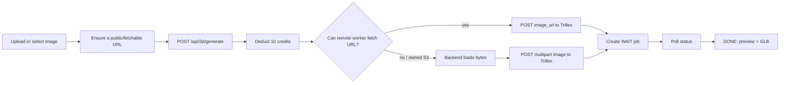

# Hydrilla cloud generation flows (Trilles / GPU)

> **Engines overview (Cloud vs Water, BYOK, API detection, error stops):**  
> see [`ENGINES.md`](./ENGINES.md) — that file is the source of truth for Water and naming.

This document keeps **deep detail for the Hydrilla cloud (Trilles) GPU path only**.  
Water is summarized here; do not duplicate Water implementation notes here.

---

## 1. Routing (both engines)


- Cloud: `selectedIsCode === false` → `/api/3d/*`, credits, GPU.
- Water: `selectedIsCode === true` → `/api/water/*`, 0 credits, no GPU.
- Full BYOK / Water docs: [`ENGINES.md`](./ENGINES.md).

---

## 2. Hydrilla cloud (Trilles) flow

### Contract

- **Primary input:** an image.
- **Optional first stage:** text, edit, or combine can create the source image.
- **Compute:** Hydrilla's FLUX and Trilles GPU gateways.
- **Output:** GLB plus a preview image.
- **Persistence:** Supabase `jobs`, workspace relations, and lineage.
- **Billing:** Hydrilla credits.

Current credit charges in
`backend/hydrilla_backend/src/routes/threeD.ts`:

- text-to-image: **2 credits**
- one-image edit: **3 credits**
- two-image combine: **4 credits**
- image-to-3D or direct text-to-3D backend route: **10 credits**

The workspace does not use the backend's direct text-to-3D branch. Its live
text-to-mesh UX is text-to-image (2) followed by image-to-3D (10), for a total
of **12 credits**.

Credits are deducted atomically when the operation is submitted
(`backend/hydrilla_backend/src/services/credits.ts`).

### 2.1 Text to image to Trilles


Key frontend functions:

- `handleGenerateImage()` / `handleGenerate3D()` / `start3DFromImage()` — `app/workspace/page.tsx`
- `generatePreviewImage()` / `submitImageTo3D()` — `lib/api.ts`

### 2.2 Uploaded image to Trilles



`submitImageTo3D()` tries the primary upload path, then Node/S3. The backend
rejects `blob:` and `data:` URLs. For owned S3 / localhost / unreachable URLs,
it loads bytes and posts multipart to Trilles.

### 2.3 Edit and combine

Preprocessing for the mesh engine only (disabled for Water models):

- **Edit:** `POST /api/3d/edit-image`, 3 credits.
- **Combine:** `POST /api/3d/combined-edit`, 4 credits.
- Then `start3DFromImage()` for +10 credits.

UI caveat: the cost line may understate Edit/Combine; backend still charges 3/4.

### 2.4 Trilles state and polling

```text
pending     -> WAIT
processing  -> RUN
completed   -> DONE
failed      -> FAIL
cancelled   -> FAIL
```

Workspace polls `GET /api/3d/status/:jobId` every ~3s (long UI cap).  
Backend `syncAllJobs()` (long-running Node) syncs FLUX vs Trilles gateways,
circuit-breaks on repeated failures, stores S3 URLs, sends completion email.

Water jobs are skipped by GPU sync — see [`ENGINES.md`](./ENGINES.md).

### 2.5 Trilles failure behavior

- Insufficient credits → HTTP `402`.
- Network/gateway submit failure → surfaced as GPU unavailable.
- Status falls back to DB when gateway is temporarily down.
- Primary then alternative FLUX/Trilles URLs.
- Credits are deducted before gateway submit completes (no automatic refund today).

---

## 3. Water (summary only)

Full documentation: **[`ENGINES.md`](./ENGINES.md)**.

- BYOK keys in Settings → encrypted → live provider probe.
- `POST /api/water/generate` → job `engine=water`, `credits_used=0`.
- Client polls; preview in `WaterViewer` + `public/water-sandbox.html` (browser iframe — **not** a Vercel Sandbox).
- Legacy alias: `/api/code-sculpt/*`.

---

## 4. Shared job behavior

Both engines:

- require authenticated, approved users and a workspace;
- write Supabase `jobs` with lineage;
- use `WAIT` / `RUN` / `DONE` / `FAIL`.

Artifact boundary:

```text
Cloud:  engine=trilles   result_kind=glb            result_glb_url=…
Water:  engine=water     result_kind=three_factory  factory_code=…
```

Library must branch on `engine` / `result_kind` / `factory_code`.  
Never send Water jobs to the GLB proxy or GPU status poller.

---

## 5. Cloud endpoints

```text
POST /api/3d/text-to-image
POST /api/3d/edit-image
POST /api/3d/combined-edit
POST /api/3d/generate
POST /api/3d/register-job
GET  /api/3d/status/:jobId
GET  /api/3d/queue/info
```

Water / key endpoints: listed in [`ENGINES.md`](./ENGINES.md).

---

## 6. Operational checklist (cloud)

- FLUX and Trilles primary/alternative gateway URLs configured.
- AWS/S3 credentials and public base URL configured.
- Credit RPC migration deployed.
- Background job sync running (non-serverless / long-lived Node).
- Clerk + Supabase + `NEXT_PUBLIC_BACKEND_URL` configured.

Water checklist (encryption secret, key verify, waitUntil): [`ENGINES.md`](./ENGINES.md).
