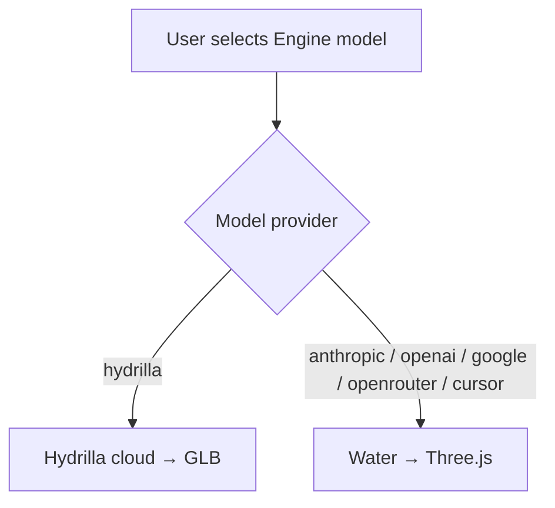
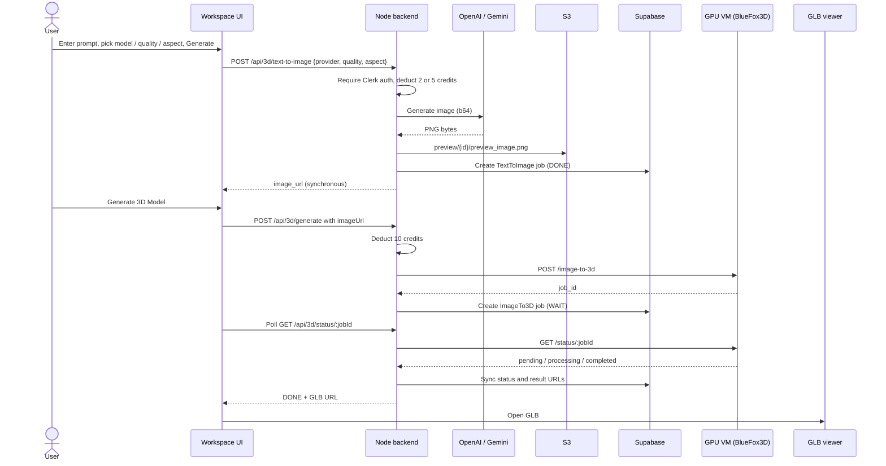
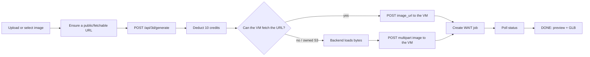

# Hydrilla cloud generation flows (Trilles / GPU)

> **Engines overview (Cloud vs Water, BYOK, auth, artifacts):**  
> see [`ENGINES.md`](./ENGINES.md) — that file is the source of truth for Water and naming.

This document keeps **deep detail for the Hydrilla cloud (Trilles) GPU path only**.  
Water is summarized here; do not duplicate Water implementation notes here.

---

## 1. Routing (both engines)


```mermaid
flowchart TD
    A[User selects Engine model] --> B{Model provider}
    B -->|hydrilla| C[Hydrilla cloud → GLB]
    B -->|anthropic / openai / google / openrouter / cursor| D[Water → Three.js]
```

- Cloud: `selectedIsCode === false` → `/api/3d/*`, credits, GPU.
- Water: `selectedIsCode === true` → `/api/water/*`, 0 credits, no GPU.
- Water models (catalog + live sync + prefs): [`ENGINES.md`](./ENGINES.md), [`WATER_PROVIDERS.md`](./WATER_PROVIDERS.md).
- Water pipeline / gates: [`WATER_ORCHESTRATION.md`](./WATER_ORCHESTRATION.md).

**Auth:** Clerk JWT (`requireAuth` on generate). No invite / approved-email gate.

---

## 2. Hydrilla cloud (Trilles) flow

### Contract

- **Primary input:** an image.
- **Optional first stage:** text-to-image or edit (OpenAI / Gemini) creates the source image.
- **Compute:** images come from the **OpenAI** or **Gemini** image APIs, called by the Node backend. Meshes come from the **GPU VM** (`hydrilla_runtime`, BlueFox3D image-to-3d) at `https://api.hydrilla.co`.
- **Output:** GLB plus a preview image.
- **Persistence:** Supabase `jobs`, workspace relations, and lineage. Image jobs store `llm_provider` / `llm_model`.
- **Billing:** Hydrilla credits.

Credit charges (`backend/src/services/imageProviders/config.ts`, `backend/src/routes/threeD.ts`):

| Operation | Low | High |
|---|---|---|
| text-to-image | **2** | **5** |
| edit | **3** | **6** |
| image-to-3D | **10** | **10** |

Text-to-3D is text-to-image followed by image-to-3D: **12** credits on Low, **15** on High.

Credits are deducted atomically when the operation is submitted
(`backend/src/services/credits.ts`). Image credits are refunded if the provider call fails.
Free tier starts at **200** credits; Creator **1000** / Studio **4000** via Dodo subscriptions.

### Image options (text-to-image + edit)

The workspace composer shows a **Model · Quality · Aspect** menu in Cloud mode (`lib/imageOptions.ts`,
persisted to `localStorage`). Aspect is only sent for text-to-image; edits keep the input's framing.

| Quality | OpenAI (`/v1/images/generations`, `/v1/images/edits`) | Gemini (Interactions API) |
|---|---|---|
| Low | `gpt-image-2.5-flare`, `quality: "medium"`, 1024×1024 / 1536×1024 / 1024×1536 | `gemini-3.1-flash-image`, `image_size: "1K"` |
| High | `gpt-image-2.5-sunburst`, `quality: "high"`, 2048×2048 / 2304×1536 / 1536×2304 | `gemini-3-pro-image`, `image_size: "2K"` |

Models can be overridden with `OPENAI_IMAGE_MODEL_LOW/HIGH` and `GEMINI_IMAGE_MODEL_LOW/HIGH` on the backend.
Keys: `OPENAI_API_KEY` / `GEMINI_API_KEY` env first, then the admin platform keys (`openai` / `google`).

### Health / feature gates

Frontend `lib/apiHealth.ts` probes `GET {BACKEND}/api/3d/health`:

| Feature | Source |
|---|---|
| `text_to_image`, `edit_image` | An OpenAI or Gemini key is configured (`providers.openai` / `providers.gemini`) |
| `image_to_3d` | GPU VM `/health` reports `pipeline_loaded` |
| `text_to_3d` | Both of the above |

The Edit tab is locked when no image provider key is configured. Providers without a key show "No key" in the menu.

Backend env: `HYDRILLA_GPU_API_URL` (falls back to `TRELLIS_GATEWAY_URL` / `TRELLIS_API_URL` / `HUNYUAN_API_URL`).

### 2.1 Text to image to Trilles


```mermaid
sequenceDiagram
    actor User
    participant UI as Workspace UI
    participant API as Node backend
    participant IMG as OpenAI / Gemini
    participant S3 as S3
    participant DB as Supabase
    participant GPU as GPU VM (BlueFox3D)
    participant Viewer as GLB viewer

    User->>UI: Enter prompt, pick model / quality / aspect, Generate
    UI->>API: POST /api/3d/text-to-image {provider, quality, aspect}
    API->>API: Require Clerk auth, deduct 2 or 5 credits
    API->>IMG: Generate image (b64)
    IMG-->>API: PNG bytes
    API->>S3: preview/{id}/preview_image.png
    API->>DB: Create TextToImage job (DONE)
    API-->>UI: image_url (synchronous)
    User->>UI: Generate 3D Model
    UI->>API: POST /api/3d/generate with imageUrl
    API->>API: Deduct 10 credits
    API->>GPU: POST /image-to-3d
    GPU-->>API: job_id
    API->>DB: Create ImageTo3D job (WAIT)
    UI->>API: Poll GET /api/3d/status/:jobId
    API->>GPU: GET /status/:jobId
    GPU-->>API: pending / processing / completed
    API->>DB: Sync status and result URLs
    API-->>UI: DONE + GLB URL
    UI->>Viewer: Open GLB
```

Key frontend functions:

- `handleGenerateImage()` / `handleGenerate3D()` / `start3DFromImage()` — `app/workspace/page.tsx`
- `generatePreviewImage()` / `editImage()` / `submitImageTo3D()` — `lib/api.ts`

### 2.2 Uploaded image to Trilles


```mermaid
flowchart LR
    A[Upload or select image] --> B[Ensure a public/fetchable URL]
    B --> C[POST /api/3d/generate]
    C --> D[Deduct 10 credits]
    D --> E{Can the VM fetch the URL?}
    E -->|yes| F[POST image_url to the VM]
    E -->|no / owned S3| G[Backend loads bytes]
    G --> H[POST multipart image to the VM]
    F --> I[Create WAIT job]
    H --> I
    I --> J[Poll status]
    J --> K[DONE: preview + GLB]
```

`submitImageTo3D()` posts via the Node backend. The backend
rejects `blob:` and `data:` URLs. For owned S3 / localhost / unreachable URLs,
it loads bytes and posts multipart to the VM.

### 2.3 Edit

Preprocessing for the mesh engine only (disabled for Water models):

- `POST /api/3d/edit-image` (multipart `image` or `image_url`, plus `prompt`, `provider`, `quality`): 3 credits Low / 6 High.
- Result stored at `edit/{id}/edited.png`; job `EditImage` (DONE) with the source image as parent.
- Then `start3DFromImage()` for +10 credits.

The two-image **Combine** mode was removed. Legacy `Combined` rows still show in the library (as edits) and in usage (under "Edit image").

### 2.4 Trilles state and polling

```text
pending     -> WAIT
processing  -> RUN
completed   -> DONE
failed      -> FAIL
cancelled   -> FAIL
```

Image jobs are created DONE and never polled. Mesh jobs: workspace polls `GET /api/3d/status/:jobId`
every ~3s (long UI cap). Library refresh polls workspace jobs every ~5s while jobs are active.

Backend status sync paths (mesh jobs only):

1. **Client poll** (primary on Vercel) — status endpoint fetches the VM when job is not terminal.
2. **Background `syncAllJobs()`** — only on long-running `src/server.ts` (`POLL_INTERVAL_MS`, default **2000**). Skips Water and image jobs. Circuit-breaks on repeated failures.
3. **GPU webhook** — `POST /api/3d/webhook/job-update` (optional).

Vercel serverless (`api/index.ts`) has **no** background sync loop.

### 2.5 Trilles failure behavior

- Insufficient credits → HTTP `402`.
- Image provider errors: `422` (moderation block / invalid request, message shown to the user), `503` `provider_not_configured` (no key) or rate limited, `504` timeout, `502` other provider failures. Credits are refunded.
- VM submit failure → surfaced as GPU unavailable.
- Status falls back to DB when the VM is temporarily down.

## 3. Water (summary only)

Full documentation: **[`ENGINES.md`](./ENGINES.md)** + **[`WATER_ORCHESTRATION.md`](./WATER_ORCHESTRATION.md)**.

- BYOK keys in Settings → encrypted → live provider probe.
- Workspace: pick **Skill** + **Quality** (Fast / Standard / Studio).
- `POST /api/water/generate` → `runStudioPipeline` → job `engine=water`, `credits_used=0`.
- Client polls `GET /api/water/jobs/:jobId`; preview in `WaterViewer` + `public/water-sandbox.html`.
- Legacy alias: `/api/code-sculpt/*`.
- Token usage + `passReviews` stored on DONE.

---

## 4. Shared job behavior

Both engines:

- require an **authenticated** Clerk user and a workspace;
- write Supabase `jobs` with lineage;
- use `WAIT` / `RUN` / `DONE` / `FAIL`.

Artifact boundary:

```text
Cloud:  engine=trilles   result_kind=glb            result_glb_url=…
Water:  engine=water     result_kind=three_factory  factory_code=…
```

Library must branch on `engine` / `result_kind` / `factory_code`.  
Never send Water jobs to the GLB proxy or GPU status poller.

---

## 5. Cloud endpoints

```text
POST /api/3d/text-to-image
POST /api/3d/edit-image
POST /api/3d/generate
POST /api/3d/register-job
GET  /api/3d/status/:jobId
GET  /api/3d/queue/info
GET  /api/3d/health
POST /api/3d/webhook/job-update
```

Water / key endpoints: listed in [`ENGINES.md`](./ENGINES.md).

---

## 6. Operational checklist (cloud)

- GPU host configured (`HYDRILLA_GPU_API_URL`, default `api.hydrilla.co`).
- `OPENAI_API_KEY` and/or `GEMINI_API_KEY` set on the backend (or admin platform keys).
- `npm run verify:images` passes in the backend.
- AWS/S3 credentials and bucket configured.
- Credit RPC migration deployed.
- Background job sync running on long-lived Node (`npm run dev` / `npm start`) — not expected on Vercel serverless alone.
- Clerk + Supabase + `NEXT_PUBLIC_BACKEND_URL` configured on the frontend.
- Frontend: `NEXT_PUBLIC_API_URL` points at the GPU VM (used for direct uploads).

Water checklist (encryption secret, key verify, waitUntil, token SQL): [`ENGINES.md`](./ENGINES.md) + backend `WATER_DEPLOY.md`.
